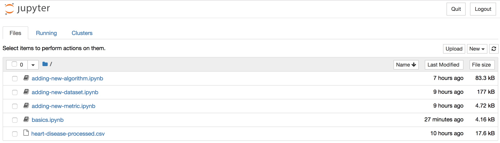

# Installing the tutorial prerequisites

The `fairness` library is written in Python 3, and the
tutorial will be using Jupyter Notebooks. In this page, we will go
over the instructions on how to install both the library itself
and Jupyter.

This document assumes that you're using Unix of some kind (Linux or
macOS).

## Virtual Environments

In order to simplify package installation, for this tutorial we highly
recommend that you use a fresh virtual environment, so that there's no
risk of conflicting package versions, etc. Let's first create a new
directory, and create a virtual environment inside it:

    $ mkdir fairness-tutorial
    $ cd fairness-tutorial
    $ python3 -m venv venv
    $ . ./venv/bin/activate
    (venv) $

The `(venv)` prompt in your shell indicates that the shell is running
in a "virtual environment": new python library installs will be
isolated from the rest of your system, so you don't risk overwriting
anything by accident. 

## The `fairness` library

Let's install the main library now:

    (venv) $ pip3 install fairness
    Collecting fairness
      Downloading https://files.pythonhosted.org/packages/f6/d0/038541647d46112174ae8f9d7ef256d73cfccc0668923748826a0d4cb63c/fairness-0.1.8-py3-none-any.whl (14.2MB)
    (.. lots more stuff like this)

    (...)
    Successfully installed (...)
    
Success! Let's make sure it runs:

    (venv) $ python3
    Python 3.6.3 (default, Oct  4 2017, 06:09:38)
    [GCC 4.2.1 Compatible Apple LLVM 9.0.0 (clang-900.0.37)] on darwin
    Type "help", "copyright", "credits" or "license" for more information.
    >>> import fairness.benchmark
    Available algorithms:
      SVM
      GaussianNB
      LR
      DecisionTree
      Kamishima
      Calders
      ZafarBaseline
      ZafarFairness
      ZafarAccuracy
      Kamishima-accuracy
      Kamishima-DIavgall
      Feldman-SVM
      Feldman-GaussianNB
      Feldman-LR
      Feldman-DecisionTree
      Feldman-SVM-DIavgall
      Feldman-SVM-accuracy
      Feldman-GaussianNB-DIavgall
      Feldman-GaussianNB-accuracy
    >>> exit()

## Additional tutorial requirements

In this tutorial, we will use Pandas, Jupyter notebook, and Altair (a
charting library, which itself requires `vega`), although they are not requirements for
`fairness`. To install them, type

    (venv) $ pip3 install pandas altair vega jupyter notebook
    ...
    
We're almost there. Now, download the [zip with the actual notebook
files we'll be using in this tutorial](tutorial-notebooks.zip), unzip
it into a new directory (below, we're calling it `nb`), and start the
Jupyter notebook application itself:

    (venv) $ curl -O https://algofairness.github.io/fatconference-2019-toolkit-tutorial/tutorial-notebooks.zip
	(venv) $ mkdir nb
	(venv) $ cd nb
	(venv) $ unzip ../tutorial-notebooks.zip
    (venv) $ jupyter notebook
    ...
    [I 20:13:17.705 NotebookApp] The Jupyter Notebook is running at:
    [I 20:13:17.705 NotebookApp] http://localhost:8888/...
    
At this point, your browser should automatically be redirected to a webpage that will look like this:

 

click on "basics.ipynb" and it will send you directly to the Jupyter
notebook where you'll be able to run our examples. 
